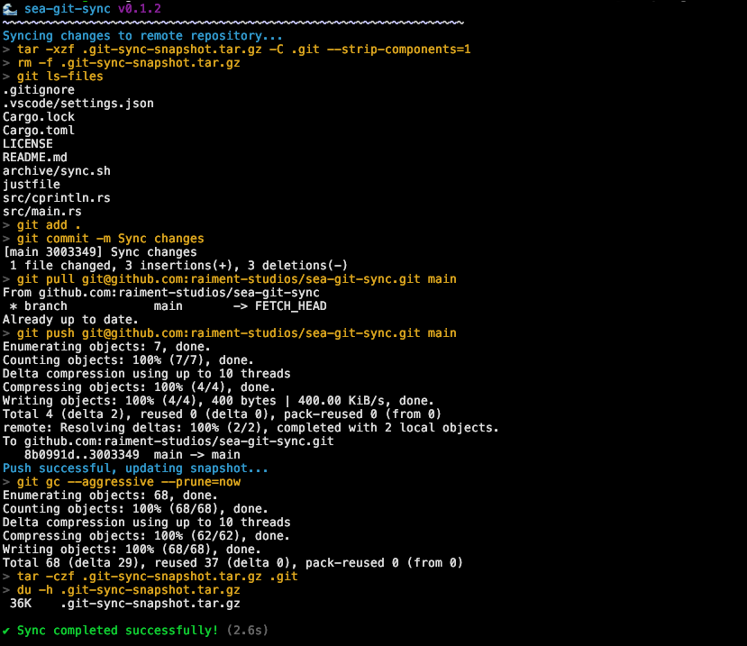

# 🌊 sea-git-sync

Utility for bidirectionally syncing a monorepo folder to a remote git repository (without submodules or subtrees).

This can be useful for working in a private monorepo and publishing an individual project to a public repo. The syncing is bidirectional which means that the public repo can accept merge requests and these will be pulled back into the monorepo. In the case of errors or merge conflicts, the syncing is all done with standard `git` commands so the user is able to resolve complex situations manually.



## Status

Currently functional but has seen limited testing, especially for non-trivial projects. Please use with caution in production. Contributions welcome to address limitations.

## Installation

**Requires**: [Rust](https://rustup.rs/) to be installed for installation.

```bash
cargo install --git https://github.com/raiment-studios/sea-git-sync
```

## Usage

```bash
cd monorepo/subdir_123/my-project
sea-git-sync --remote git@github:yourcompany/my-project.git
```

## Development

### Contributing

Please feel free to file issues and open pull requests on GitHub!

### How it works

This is not a particularly complex program!

The sync works essentially by creating and keeping a `.git-sync-snapshot.tar.gz` file _in the monorepo_ for any sync'ed folder. This is just a zip fo the `.git` folder from the last sync. But persisting the `.git` history from the prior sync, git is (more likely) able to do an automatic merge between changes that may have happened on either the local monorepo or remote project repo.

### Roadmap

-   [ ] Handle initial sync to an empty repo correctly
-   [ ] Additional user testing
-   [ ] Better user notification of how to handle failed automatic merges

### History

Created in July 2025 as a Rust application based on a Bash script that was used in the private Raiment Studios monorepo.

## FAQ

Nothing so far...

## License

See [LICENSE](LICENSE).
